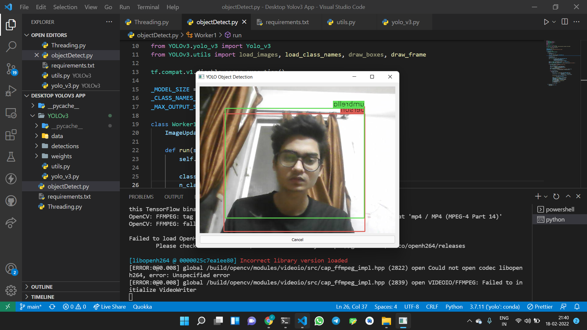

#RealTime Object Detection Desktop App

Here, I've integrated the yolov3 Object Detection Model with simple Pyqt5 GUI for a better user experience.

For yolov3 model, you can check out my previous repository.
